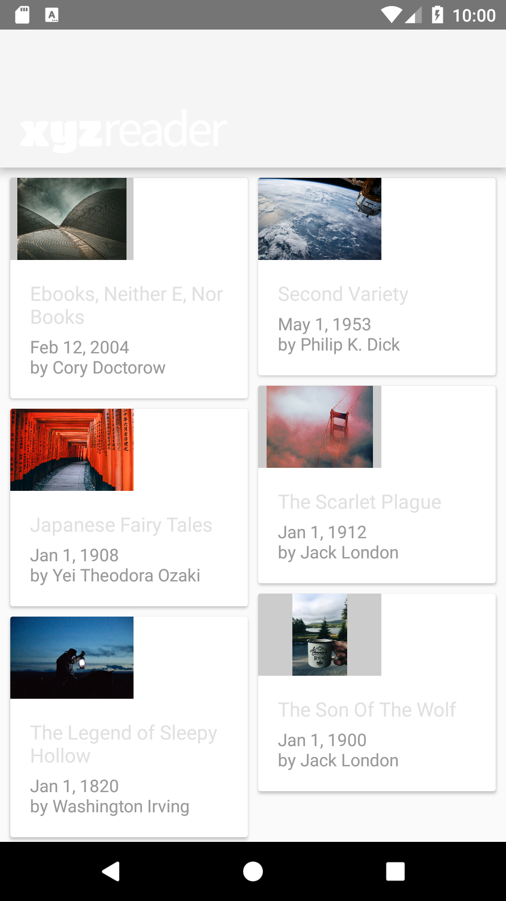
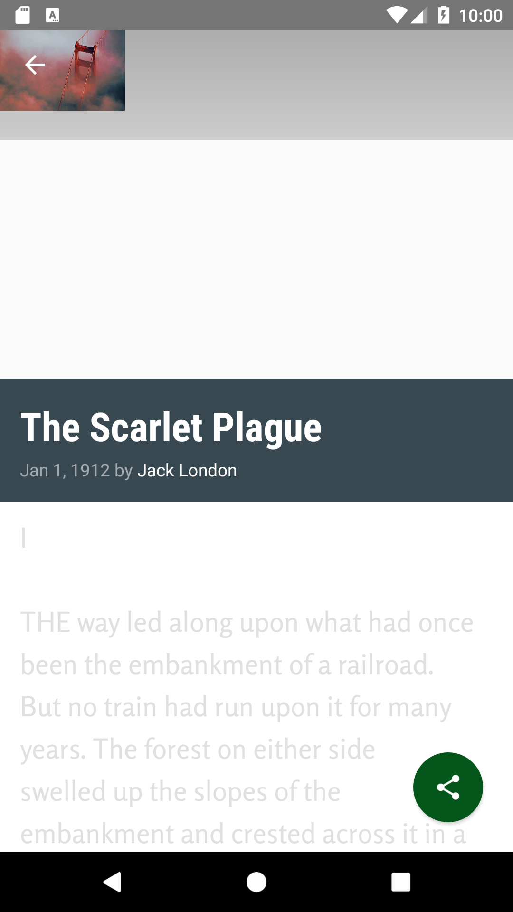
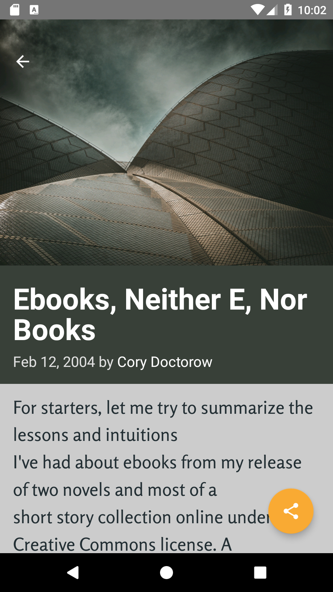

# Make It Material 

## Overview
The starter code for this project can be found [here](file:///Users/astervaldemoro/Downloads/xyz-reader-starter-code.html). This app is fully functional and works with most phones, but requires a serious redesign. This project required to take the user feedback in the UI Review, and implement changes that will improve the UI and make it conform to Material Design.

## Before Redesign
&nbsp;&nbsp;
&nbsp;&nbsp;

## After Redesign
&nbsp;&nbsp;
&nbsp;&nbsp;
&nbsp;&nbsp;
